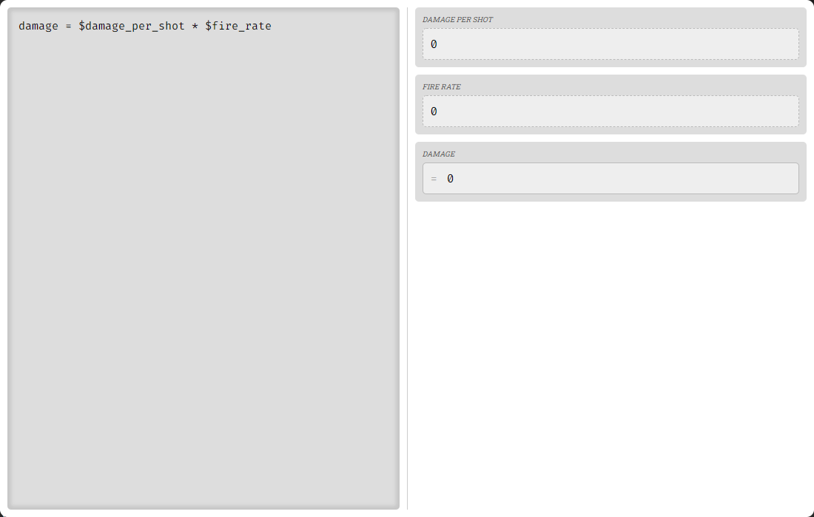
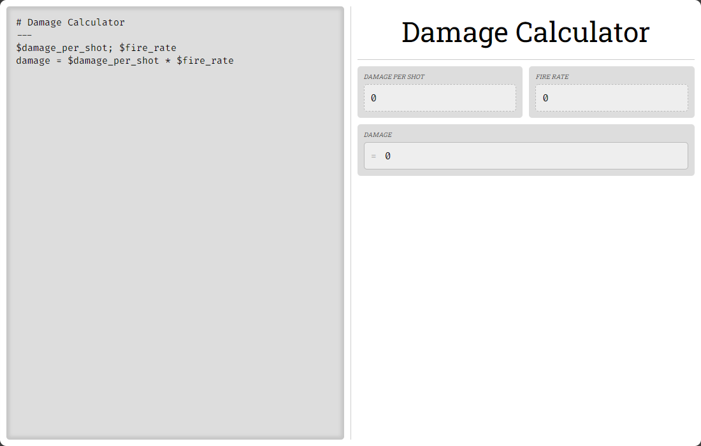
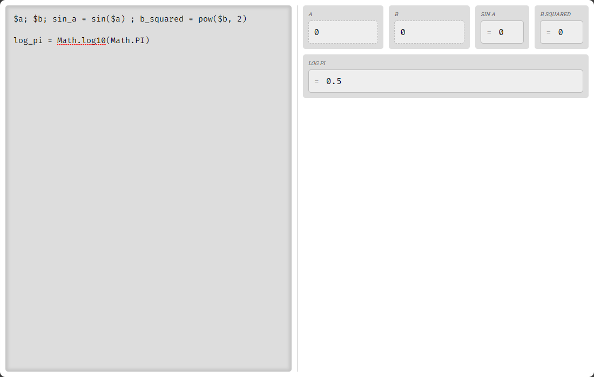
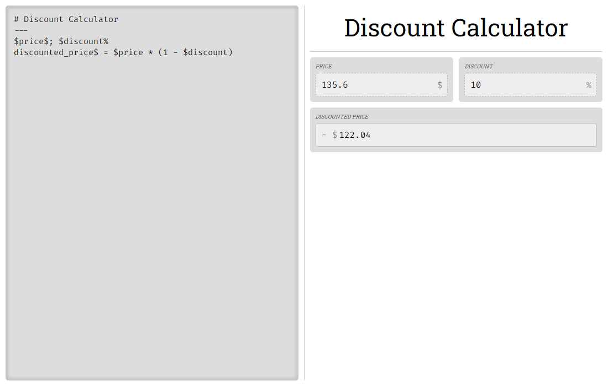

# Calculr

Electron app that allows you to create custom calculators!


## Running

Run dev server:
```
npm start
```

Build to native Windows app:
```
npm run make
```

## Usage and Syntax

Generate an output node called `Damage`, and two input nodes `Damage per Shot` and `Fire Rate`:
```js
damage = $damage_per_shot * $fire_rate
```


Or declare the input nodes first and stack them horizontally on the same row:
```
$damage_per_shot ; $fire_rate
damage = $damage_per_shot * $fire_rate
```


Headings and horizontal lines - h1 to h6:
```md
# Damage Calculator
---
$damage_per_shot; $fire_rate
damage = $damage_per_shot * $fire_rate
```


The code is `eval()`uated as normal JS, with a few abbreviations in.

```js
$a; $b; sin_a = sin($a) ; b_squared = pow($b, 2)

log_pi = Math.log10(Math.PI)
```


Percentage nodes like `$discount%` auto-divide their input by 100, and show a `%` symbol on them. Currency nodes like `$price$` show a `$` symbol.
```
# Discount Calculator
---
$price$; $discount%
discounted_price$ = $price * (1 - $discount)
```
_e.g. 30 becomes 0.3_
