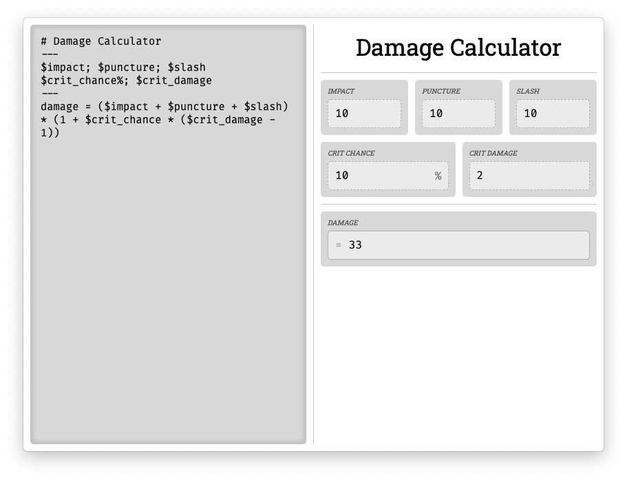

# Calculr

Electron app that allows you to create custom calculators!



## Syntax

Generate an output node called `Damage`, and two input nodes `Damage per Shot` and `Fire Rate`:
```
damage = $damage_per_shot * $fire_rate
```

Or declare the input nodes first and stack them horizontally on the same row:
```
$damage_per_shot; $fire_rate
damage = $damage_per_shot * $fire_rate
```

Headings and horizontal lines - h1 to h6:
```
# Damage Calculator
---
$damage_per_shot; $fire_rate
damage = $damage_per_shot * $fire_rate
```

Percentage nodes auto-divide their input by 100, and show a `%` symbol on them:
```
# Discount Calculator
---
$price; $discount%
discounted_price = $price * (1 - $discount)
```
_e.g. 30 becomes 0.3_
